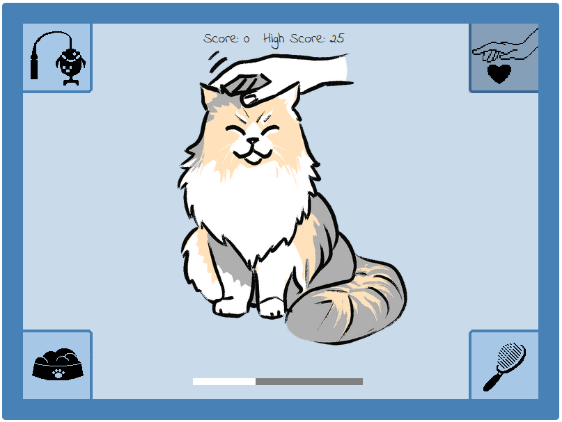

# Cat-It

## A JavaScript Game

This is a website designed to deliver a simple JavaScript game to the user. It is a game accessible to all, and has two aims in mind: to be fun to play the first time, and to encourage replayability. To this end, the subject matter is cats - something that the internet has long had a love affair with - and there is a high score function that stores your own highest score, enabling replayability. The site is targeted primarily at anyone who wishes to play the game, and exists solely for this game. However, there are a great many places where this game could be at home and where JavaScript games are hosted - this game is designed to fit into this niche, and the website merely serves up the game to the player.

The game will be designed to work on smaller screens, and should be responsive as the page is resized. The game will actually play better on a smaller screen, as the controls will be closer at hand.

## Game Concept
With inspiration drawn from the hit physical game Bop-It, this game has a simple premise: follow instructions as they get faster. If you fail to follow the instruction in time, you lose. The longer one is able to keep up with the instructions, the greater the player's high score. The clickable icons for the instructions are set far enough apart that some physical prowess can come into this game - navigating to the correct icon in time advances the game to the next round. The game gets steadily harder; after a set amount of inputs, the speed between instructions lessens.

As an open-ended game, there is only one lose-state - the player is unable to input the correct answer in time, and is taken to the Game Over screen. From there, they can either choose to wipe their high score and set a new one, or play again and hope to beat the existing high score. 

The site is designed to work on three different screen sizes, including Desktop, Tablet and Phone sizes.

A note about copyright: This game is intended as a parody of Bop-It, which is © Hasbro, and is in no way designed to infringe on the copyright of Bop-It. This game is not made for the purposes of making money, and all rights to the game Bop-It and to the mechanics that are represented under the copyright remain the property of the copyright owner.

## User Story
As a player, I want:
+ An enjoyable gameplay loop
+ Strong visuals that do not detract from the gameplay
+ Clear feedback on whether I have performed a game action
+ Bug-free gameplay
+ Feedback at the end of the game as to my performance
+ Some ability to measure my performance against others
+ Replayability options and value

## Features and Wireframe
This site comprises one page, with a game screen centred at the top. The game itself has several states - The instructions (represented as a modal), the You Lose screen (also a modal), and a background for each of the actions. After each of the instruction icons are clicked, if they are clicked correctly, a brief picture of the cat doing whatever action it was will pop up. As the game gets faster, these will deliberately become quicker flashes, with some subjective hilarity and also to make subsequent turns harder through distraction.

The game images presented here are not final, and are indicative of what a user might see at the point in prototyping that this section of the Readme was written. Images used are stock images, detailed below, and colours and designs are not final and are subject to change after prototyping and user testing.

### Title Page


### Default Game State


### Stroke It


### Brush It


### Feed It


### Play Time


### Game Over


## Upcoming features
+ Hard Mode - there are various options for making this harder, such as moving where the icons are (rotating them around and giving some warning to the player that this is happening); adding a fifth, sixth, etc icon; or chaining two or more actions together before requiring input from the player. These are all potential upgrades for this game.
+ High Scores - a table of high scores would be a good feature to have. Unfortunately, during creating this project, that high score table was not within the scope of this project. Instead, I focused on saving just the player's most recent high score in local storage. However, it would make an excellent extension for ths project in the future.

## Technology
+ This website was made in its entirety using Visual Code Studio
+ Wireframe and prototyping images were made in Figma
+ Additional software used to create this website include Photoshop for image editing and Chrome for previewing, inspecting and bug testing

## Testing
### Test Case: Instructions Modal Onscreen
+ During time when Instruction Modal is onscreen: Clicking inside game space but not on buttons should have no effect
+ During time when Instruction Modal is onscreen: Clicking on the 'Reset High Score' button should bring up an alert in the browser, and the score should be reset, but not close the Modal
+ During time when Instruction Modal is onscreen: Clicking on the button to start the game should close the Modal and begin the game after a pause of 1000ms


### Test Case: Game General
+ Click outside game space; should have no effect on game
+ The game space should have one square icon in each corner, depicting one of the four possible commands of Play Time (a cat toy on a string); Feed It (a bowl of cat food); Brush It (a brush); and Pet It (a hand and a heart)
+ The game space should also have a default picture in the middle of a cat at rest, which changes when any of the four buttons are pressed to a picture of the cat experiencing whatever command was given
+ When the game is active: Clicking on any of the four buttons at any time should change the background to match the button pressed
+ When the game is active: Without prompting from the player, an audio file should play at random
+ When the game is active: The bar at the bottom of the game space should count down visually to represent the time out
+ When the game is active: If the bar reaches 0% filled, the Loss Modal should appear
+ WHen the game is active: If the incorrect button is pressed, not matching the audio command given, the Loss Modal should appear
+ When the game is active: When the correct button is activated that corresponds with the audio instruction given, another command should be given and the timer reduced by 10ms
+ When the game is active: Although small decrements in the timer may not be visible on a round-to-round basis, over time it should become apparent that the timer has decreased


### Test case: Loss Modal Onscreen
+ When the Loss Modal is onscreen: Clicking 'Reset High Score' button should bring up an alert in the browser, and the score should be reset, but not close the Modal
+ When the Loss Modal is onscreen: Clicking inside the game space, but not on the buttons, should have no effect
+ When the Loss Modal is onscreen: Clicking the 'Play again' button should reset the game, but not the high score value


### Bugs discovered
+ Properly aligning the square buttons in the four corners of the game space was probably among the hardest parts of designing this, as I could align them in other places fairly easily. Ultimately I solved this with CSS, but I have since broken this alignment at least once while trying to tweak and make more efficient my CSS.
+ Aligning and setting the size on the progress bar was also tricky. Having it reduce from 100% full to 0% is a default behaviour, but the time it needs to progress this in changes with every round, reducing by 10ms. Ultimately, having it take the variable from the internal timer to the game every round and effectively reload has solved the problem.
+ However, making the Progress Bar reduce by the correct amount on the first round, while also decreasing in a smooth fashion, was a major blocker for a while. This was solved ultimately by adjusting the refresh rate for the bar so that it correctly calculates the amount it needs to reduce by every time it checks.
+ I encountered a bug very late in development where pressing 'Play again' would sometimes grant the player 1 point without them having pressed any of the four buttons. This was because the variable buttonPress still had the most recent button press logged to it, and there is a 1/4 chance that the last command in the losing game will be the first command in the new game. Adding a null value to buttonPress when the 'Play Again' button is pressed removed this problem.

## Code validation
### <a href="https://validator.w3.org/" target="_blank">W3C</a>

+ <a href="https://validator.w3.org/nu/?doc=https%3A%2F%2Fstevecook23.github.io%2Fcat-it%2F" target="_blank">Game page validation</a>


### Lighthouse Report:

 

### <a href="https://jshint.com/" target="_blank">JSHint</a>

 

## Supported Screens and Browsers
+ This website works in any browser and at any screen size, from desktop down to smart phones.
+ It has been developed and tested in Chrome, and smaller screen sizes have been simulated with Chrome's Inspect tool. Sample screens of all currently-available smart phones have been tested through Chrome's Inspect tool. It has also been tested natively on a Pixel 7a device.

## Deployment
This website has been deployed on Github Pages. It was developed locally, using a clone of the repository on Github, available at Github.

To view the deployment on Github Pages:

+ Navigate to https://stevecook23.github.io/cat-it/
+ Alternatively, navigate to https://github.com/stevecook23/cat-it
+ Click 'Actions'
+ Click on the most recent workflow run
+ Click the link under 'Deploy'

To clone the repository from Github in your editor of choice:

+ First, open your terminal.
+ Change the current working directory to the location where you want the cloned directory.
+ Input: ```bash
+ Input: cd path/to/your/directory (ensure you change the directory to whatever you want to clone the repository)
+ Clone the repository by running: git clone https://github.com/stevecook23/cat-it.git
+ Change directories into the cloned repository: cd cat-it

Now you have a copy of the source code and can start to work on it.

The Visual Studio Code preview extension was used to preview the website. To open this repository on Visual Studio Code:

+ Open an integrated terminal from the menu Terminal -> New Terminal
+ Clone the repo with the following command: git clone https://github.com/stevecook23/cat-it
+ Change your terminal into that new subdirectory: cd cat-it
+ Open in Visual Studio Code: code .

## Credits
### Text Content
Text is written in its entirety by Steve Cook

### Media
#### Readme Images
Some images used during initial concept and during development have been sourced through UnSplash, a Figma Plugin, and are used by permission. Although they are not visible in the final product, I am grateful for their use. They can be found at the following addresses:
+ <a href="https://unsplash.com/photos/gray-kitten-sitting-on-floor-fEK4jvgnApg" target="_blank">Stock image used for Default Wireframe</a>
+ <a href="https://unsplash.com/photos/cute-brown-cat-looking-at-appetizing-homemade-pancakes-on-plate-with-fresh-berries-jam-honey-and-sourcream-on-table-pl2lEC0d58I" target="_blank">Stock image used for Stroke It Wireframe (later renamed to Pet It)</a>
+ <a href="https://unsplash.com/photos/selective-focus-photography-of-lying-russian-blue-cat-N8lcQwgx4so" target="_blank">Stock image used for Play Time Wireframe</a>
+ <a href="https://unsplash.com/photos/white-and-brown-short-coated-dog-zE1Ej5Wu4vU" target="_blank">Stock image used for Brush It Wireframe</a>
+ <a href="https://unsplash.com/photos/cute-brown-cat-looking-at-appetizing-homemade-pancakes-on-plate-with-fresh-berries-jam-honey-and-sourcream-on-table-pl2lEC0d58I" target="_blank">Stock image used for Feed It Wireframe</a>

#### Game Images
Images for this game were made by Susan Cook and used with permission. You can find more of her work at <a href="https://www.susancook.me/" target="_blank">her website</a>.

#### Audio
Audio for this game was recorded from the Pi artificial intelligence assistant.