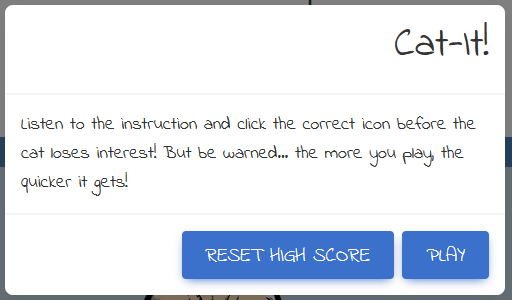
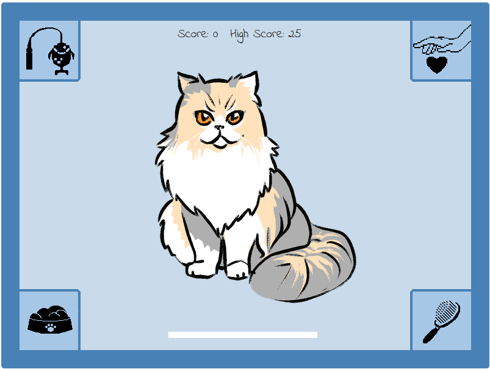
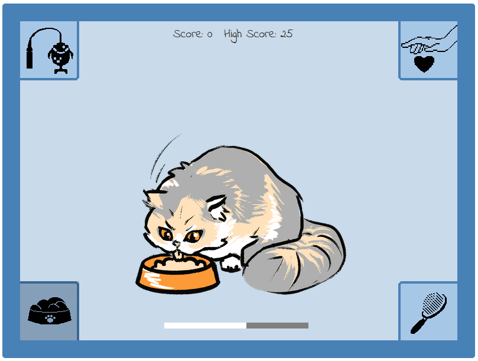

# Cat-It

## A JavaScript Game

This is a website designed to deliver a simple JavaScript game to the user. It is a game accessible to all, and has two aims in mind: to be fun to play once, and to encourage replayability. To this end, the subject matter is cats - something that the internet has long had a love affair with - and there is a high score table detailing the top ten longest playtimes. The site is targeted primarily at anyone who wishes to play the game, and exists solely for this game. However, there are a great many places where this game could be at home and where JavaScript games are hosted - this game is designed to fit into this niche, and the website merely serves up the game to the player.

The game will be designed to work on smaller screens, and should be responsive as the page is resized.

## Game Concept
With inspiration drawn from the hit physical game Bop-It, this game has a simple premise: follow instructions as they get faster. If you fail to follow the instruction in time, you lose. The longer one is able to keep up with the instructions, the greater the player's high score. The clickable icons for the instructions are set far enough apart that some physical prowess can come into this game - navigating to the correct icon in time advances the game to the next round. The game gets steadily harder; after a set amount of inputs, the speed between instructions lessens.

As an open-ended game, there is only one lose-state - the player is unable to input the correct answer in time, and is taken to the Game Over screen. From there, they can input their name to have it registered on the high scores, and then choose to play again or to view the High Scores. 

The site is designed to work on three different screen sizes, including Desktop, Tablet and Phone sizes.

## User Story
As a player, I want:
+ An enjoyable gameplay loop
+ Strong visuals that do not detract from the gameplay
+ Clear feedback on whether I have performed a game action
+ Bug-free gameplay
+ Feedback at the end of the game as to my performance
+ Some ability to measure my performance against others
+ Replayability options and value

## Features and Wireframe
This site comprises one page, with a game screen centred at the top. The game itself has several states - The main title, the Game Over screen, the High Scores screen, and a background for each of the actions. The page has a Footer, which contains a link to my own portfolio, and social media links. After each of the instruction icons are clicked, if they are clicked correctly, a brief picture of the cat doing whatever action it was will pop up. As the game gets faster, these will deliberately become quicker flashes, with some subjective hilarity and also to make subsequent turns harder through distraction.

The game images presented here are not final, and are indicative of what a user might see at the point in prototyping that this section of the Readme was written. Images used are stock images, detailed below, and colours and designs are not final and are subject to change after prototyping and user testing.

### Title Page

### Default Game State

### Stroke It

### Brush It

### Feed It

### Play Time

### Game Over

### High Scores

## Upcoming features
+ Hard Mode - there are various options for making this harder, such as moving where the icons are (rotating them around and giving some warning to the player that this is happening); adding a fifth, sixth, etc icon; or chaining two or more actions together before requiring input from the player. These are all potential upgrades for this game.

## Technology
+ This website was made in its entirety using Visual Code Studio
+ Wireframe and prototyping images were made in Figma
+ Additional software used to create this website include Photoshop for image editing and Chrome for previewing, inspecting and bug testing

## Testing
### Test case: Game
+ Not yet implemented

### Bugs discovered
+ Not yet implemented

## Code validation
### <a href="https://validator.w3.org/" target="_blank">W3C</a>

### Lighthouse Report:

## Supported Screens and Browsers
+ 

## Deployment

## Credits
### Content
Text is written in its entirety by Steve Cook

### Media
#### Images
Images used in this Readme have been sourced through UnSplash, a Figma Plugin, and are used by permission. They can be found at the following addresses:
+ 
